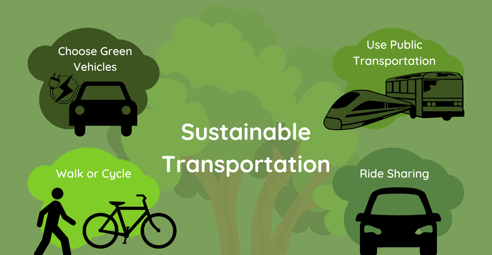

<!DOCTYPE html>
<html lang="en">
<head>
    <meta charset="UTF-8">
    <meta name="viewport" content="width=device-width, initial-scale=1.0">
    <link rel="stylesheet" href="style.css">
</head>
<body>
    <header class="header">
        <h1>DAA Portfolio</h1>
    </header>
    <main>
        
        <section class="about">
            <h2>Hello, I'm ADITYA GAVADE 👋</h2>
            
I am passionate about technology and problem-solving. Here's a glimpse of my work:

        </section>
        <section class="projects">
            <h2>🛠 Projects</h2>
            

                <h3>Project 1: Urban Sustainable Mobility of Greater Transportation
Objectives:</h3>
                <ul>
<li>Analyze urban transportation trends to enhance sustainability and optimize mobility systems.
Predict and mitigate transportation bottlenecks using computational models.
Features:</li>

<li>Real-time transportation data analysis through efficient algorithms.
Predictive models implemented using C++ for high performance and reliability.
User-friendly visualization tools to showcase transportation trends.
Technologies:</li>

<li>Programming Language: C++ for processing transportation data and implementing predictive models.
Integration with GPS/IoT data sources for dynamic inputs.
Libraries: Use STL, Boost, or third-party libraries for data processing and analysis.
Applications:</li>

<li>Better traffic and public transit management.
Enhanced commuter experience with optimized schedules and routes.
Support for urban planning to promote sustainable and eco-friendly transportation.</li>
                </ul>
            

        </section>
        <section class="skills">
            <h2>🚀 Skills</h2>
            <ul>
                <li>C++, Python, JavaScript</li>
                <li>Data Structures and Algorithms</li>
                <li>Web Development (React.js, Node.js)</li>
            </ul>
        </section>
        <section class="find-me">
            <h2>🌐 Find Me Online</h2>
            
<a href="https://github.com/adityagavde48" target="_blank">GitHub</a> | <a href="https://www.linkedin.com/feed/" target="_blank">LinkedIn</a>

        </section>
        <section class="details">
            <h2>Portfolio Topic</h2>
            <dl>
                <dt>Course</dt>
                <dd>DAA (Algorithmic Problem Solving)</dd>
                <dt>Name</dt>
                <dd>ADITYA GAVADE</dd>
                <dt>SRN</dt>
                <dd>02FE24BCS408</dd>
                <dt>Course Instructor</dt>
                <dd>Shankar B</dd>
                <dt>University</dt>
                <dd>KLE TECHNOLOGY UNIVERSITY </dd>
                <dt>Department</dt>
                <dd>COMPUTER SCIENCE AND ENGINEERING (BE)</dd>
            </dl>
        </section>
        <blockquote>
            "Aspiring Engineering Student | Passionate about Innovation and Problem-Solving | Committed to Continuous Learning and Growth | Open to Networking and Collaboration"
        </blockquote>
    </main>
    <h1>Project_code</h1>
    <a href="project.txt" download>Code download</a>
    <footer class="footer">
        
&copy; 2025 Aditya Gavade

    </footer>
</body>
</html>
